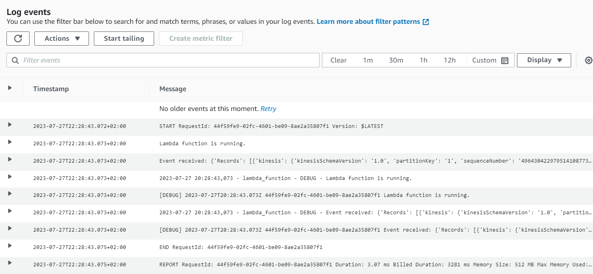

# IaC Terraform

The code here is the IaC for the deployment in AWS using Terraform. the first step is to install Terraform

```bash
conda install -c conda-forge terraform
```

Then follow the next steps:

- Initialize Terraform and apply the configuration:

  ```bash
  terraform init
  ```

- Plan and apply Terraform adding the absolute path:

  ```bash
  terraform plan -var-file=C:\absolute_path_to\mlops-car-prices\terraform\vars\stg.tfvars
  ```

  ```bash
  terraform apply -var-file=C:\absolute_path_to\mlops-car-prices\terraform\vars\stg.tfvars
  ```

- If any error, push the Dockerimage:

  ```bash
  docker build --no-cache -t lambda_image:latest .
  ```

  ```bash
  docker tag lambda_image:latest ${AWS_ID}.dkr.${AWS_DEFAULT_REGION}.amazonaws.com.stg_ecr_model_duration_mlops-zoomcamp:latest
  ```

  ```bash
  docker push ${AWS_ID}.dkr.${AWS_DEFAULT_REGION}.amazonaws.com.stg_ecr_model_duration_mlops-zoomcamp:latest
  ```

- One the whole set up is done, you can send a record to AWS. Go to the scripts folder, add your `BUCKET_NAME` and `RUN_ID` in `deploy.sh` and run:

  ```bash
  ./deploy.sh
  ```

- Then put a record in the Kinesis Stream:

  ```bash
  aws kinesis put-record --stream-name stg_car_events-mlops-zoomcamp --partition-key 1 --cli-binary-format raw-in-base64-out --data '{\"car_ID\": 10, \"symboling\": 0, \"CarName\": \"audi 5000s (diesel)\", \"fueltype\": \"gas\", \"aspiration\": \"std\", \"doornumber\": \"two\", \"carbody\": \"hatchback\", \"drivewheel\": \"4wd\", \"enginelocation\": \"front\", \"wheelbase\": 99.5, \"carlength\": 178.2, \"carwidth\": 67.9, \"carheight\": 52, \"curbweight\": 3053, \"enginetype\": \"ohc\", \"cylindernumber\": \"five\", \"enginesize\": 131, \"fuelsystem\": \"mpfi\", \"boreratio\": 3.13, \"stroke\": 3.4, \"compressionratio\": 7, \"horsepower\": 160, \"peakrpm\": 5500, \"citympg\": 16, \"highwaympg\": 22, \"price\": 17859.17}'
  ```

- The result shall be visible in AWS CloudWatch:



